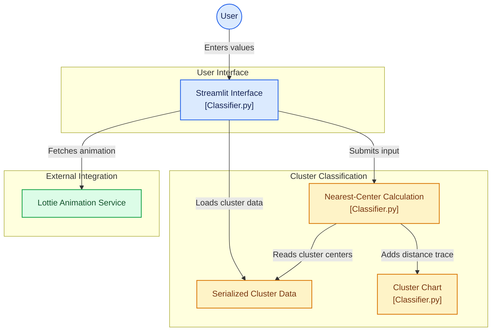

## Customer Segmentation Workflow

```mermaid
flowchart TD
    subgraph group_interface["User Interface"]
        node_app["Streamlit Interface<br/>[Classifier.py]"]
    end

    subgraph group_classification["Cluster Classification"]
        node_classifier["Nearest-Center Calculation<br/>[Classifier.py]"]
        node_model["Serialized Cluster Data"]
        node_chart["Cluster Chart<br/>[Classifier.py]"]
    end

    subgraph group_integrations["External Integration"]
        node_animation["Lottie Animation Service"]
    end

    node_user(("User"))

    node_user -->|"Enters values"| node_app
    node_app -->|"Submits input"| node_classifier
    node_app -->|"Loads cluster data"| node_model
    node_classifier -->|"Reads cluster centers"| node_model
    node_classifier -->|"Adds distance trace"| node_chart
    node_app -->|"Fetches animation"| node_animation

    click node_app "https://github.com/yassakamille/customer-segmentation/blob/main/Classifier.py"
    click node_classifier "https://github.com/yassakamille/customer-segmentation/blob/main/Classifier.py"
    click node_model "https://github.com/yassakamille/customer-segmentation/blob/main/Customer_Segmentation_model"
    click node_chart "https://github.com/yassakamille/customer-segmentation/blob/main/Classifier.py"

    classDef toneNeutral fill:#f8fafc,stroke:#334155,stroke-width:1.5px,color:#0f172a
    classDef toneBlue fill:#dbeafe,stroke:#2563eb,stroke-width:1.5px,color:#172554
    classDef toneAmber fill:#fef3c7,stroke:#d97706,stroke-width:1.5px,color:#78350f
    classDef toneMint fill:#dcfce7,stroke:#16a34a,stroke-width:1.5px,color:#14532d
    classDef toneRose fill:#ffe4e6,stroke:#e11d48,stroke-width:1.5px,color:#881337
    classDef toneIndigo fill:#e0e7ff,stroke:#4f46e5,stroke-width:1.5px,color:#312e81
    classDef toneTeal fill:#ccfbf1,stroke:#0f766e,stroke-width:1.5px,color:#134e4a

    class node_app,node_user toneBlue
    class node_classifier,node_model,node_chart toneAmber
    class node_animation toneMint
```

